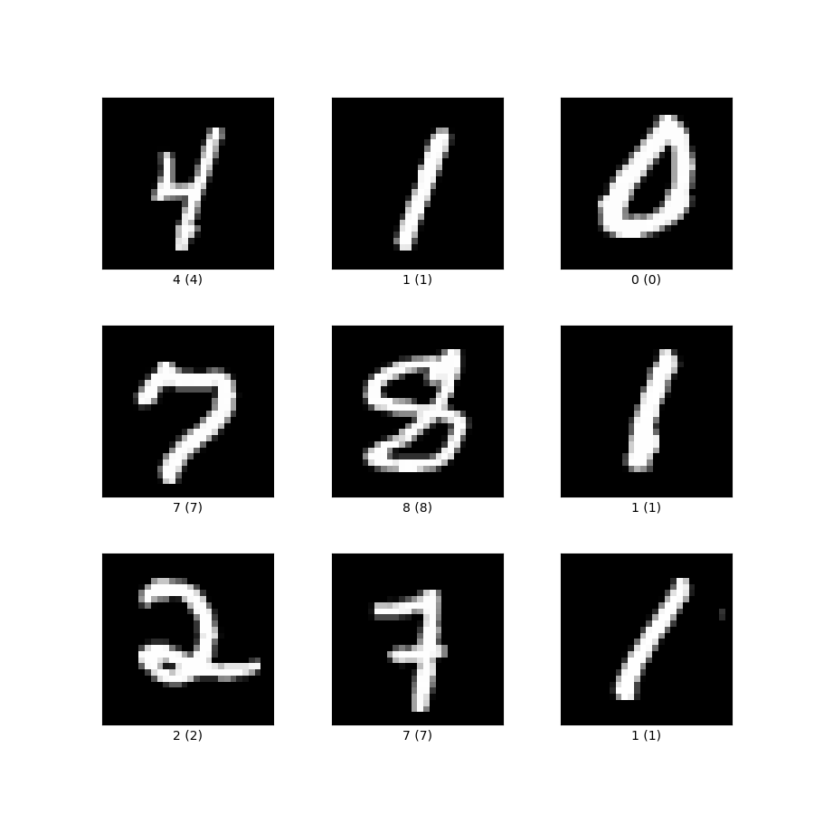
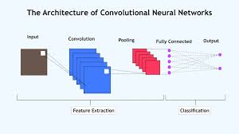

# Autoencoder

이 프로젝트의 목적은 각종 autoencoder 방법으로 MNIST dataset를 축약하고 다시 복원해 그 결과를 비교하는 것이다.

1. Dataset
MNIST 는 아래 사진과 같이 28x28의 픽셀로 이루어진 숫자의 이미지이다.

이 이미지를 텐서로 변환하면 (batch size, 채널=1, 높이 픽셀=28, 너비 픽셀=28) 모양의 텐서가 된다.

2. CNN autoencoder 
이미지의 정보를 보존하기 위해 CNN autoencoder 모델을 사용한다.

Kernel size = 3 , stride = 1 , padding = 1 을 사용. 

- Encoder단계에선 2번의 CNN 과정을 거친후 1024의 encoding size로 flatten 해준다

첫 Convolution과 max pooling을 통해 size (24,14,14)를 만듬
두번째 convolution과 max pooling을 통해 size (48,7,7)
세번째 convolution size(96,3,3)
flatten 한후 1차원의 512크기의 tensor로 축소.

- Decoder 단게에선 역컨벌루션
512크기의 1차원 텐서를 다시  (96,3,3)로 확장
1차 역컨벌루션 (48,7,7) relu
2차 역컨벌루션 (24,14,14) relu
3차 역컨벌루션 (1,28,28) 으로 복원 

3. 

3.  Stochastic Encoder

4.  DAE
5. CAE
6. 결과 비교

