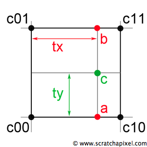
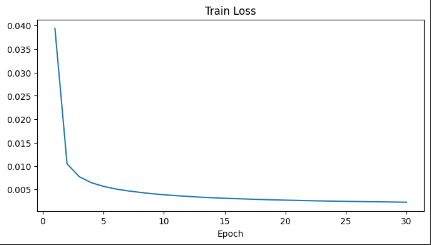

# Autoencoder #

이 프로젝트의 의의는 Autoencoder 모델을 설계해 MNIST Dataset를 
축약하고 다시 복원해 그 결과를 비교하는 것이다. 또, 임베딩된 이미지들을
t-SNE을 통해 2차원으로 축소 후 시각화해 각 숫자들의 밀집도, 그리고 
위치를 통해 모델의 정확성을 판단한다.

### 1. 데이터셋 ###

MNIST dataset은 아래 사진과 28x28(높이x너비)의 픽셀로 이루어진 숫자들의 이미지이다. 
0~9까지의 숫자의 이미지들이 label과 함께 주어져있다.

    

이미지를 텐서로 변환하면 (채널=1, 높이 픽셀=28, 너비 픽셀=28) 모양의 텐서가 된다.

### 2. 모델  ###
이미지의 정보를 축약하고 다시 복원하는 과정에서 
이미지의 정보를 보존하기 위해 CNN autoencoder 모델을 사용한다.
Encoding 과정에선 원본의 feature들을 추출하고 256차원의
벡터로 embedding한다. Decoder를 통해 embedding된 
이미지를 원본의 사이즈로 복원시킨다.

    

#### Encoding 단계 ####
- Kernel size = 3 , stride = 1 , padding =  1 을 사용
- 1차 Convolution과 max pooling 후 size *(24, 14, 14)* 로 변환
- 2차 Convolution과 max pooling 후 size *(48, 7, 7)* 로 변환
- 3차 Convolution과 max pooling 후 size *(96, 3, 3)* 로 변환
- Flatten 한후 FC layer를 통해 256크기의 1차원 텐서로 축소.

#### Decoding 단계 ####
-  Kernel size = 3, Stride = 2, Padding = 1, Output Padding = 1
- FC Layer을 통해 256 크기의 1차원 텐서를 다시 *(96 * 3 * 3)* 로 확장
- 1차 역컨벌루션을 통해 size *(48, 6, 6)* 로 변환 
- 2차 역컨벌루션을 통해 size *(24, 12, 12)* 로 변환
- 3차 역컨벌루션을 통해 size *(12, 24, 24)* 로 변환
- 입력의 사이즈를 맞춰주기 위해 Bilinear interpolation을 사용해 *(12, 28, 28)* 로 변환
- Channel을 줄이고 사이즈는 유지하기위해 conv2d로 *(1, 28, 28)* 로 변환

#### Bilinear Interpolation (쌍선형 보간법) ####
Upsampling 과정에서 역컨벌루션으로만은 애매한 정수 계산 문제가 있어 
Bilinear interpolation + Convolution 을 하는 방법을 사용했다. 쌍선형 보간법은
아래 그림과 같이 4점의 값이 주어졌을때 1차원 보간법을 x축과 y축으로 두번 적용하여
사이값을 추정하는 방법이다.  

    

### 3. 학습
손실함수는 Mean Squared Loss를 사용했고 Adam Optimizer를 사용했다. 
총 30 epoch를 학습시켰고 patience = 5의 Early Stopping 기능을 사용했다.

    

### 4.결과
학습된 모델로 무작위로 6개의 사진을 복원하고 원본과 비교했다. 
원본과 비교했을때 상당히 잘 복원되었다는 것을 확인할 수 있다.

    

### 5. Embedding 시각화
t-SNE을 사용해 encoder단계 후 embedding된 이미지를 2차원으로 나타냈다.
아래 그림과 같이 각 숫자들이 서로의 영역을 오버랩하지 않고 잘 밀집되어있는것을
볼 수 있다. 

    

x축의 가장 오른쪽에는 0과 6의 cluster가 위치해있고 가장 왼쪽엔 1의 cluster가
위치해있다. 0과 6의 모양새가 공유하는 둥글둥글한 특징과 1의 직선적인 특징을
모델이 잘 구분했다는것을 시각적으로 알 수 있다.

