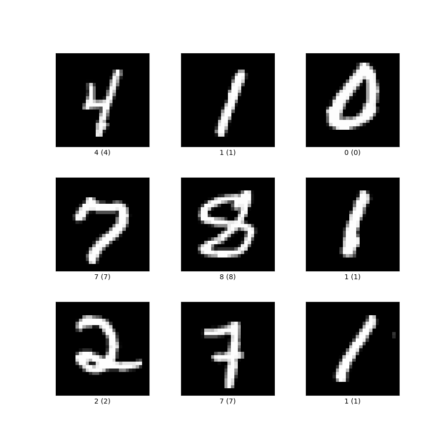

# Autoencoder

이 프로젝트의 의의는 Autoencoder 모델을 설계해 MNIST Dataset를 
축약하고 다시 복원해 그 결과를 비교하는 것이다. 또, 임베딩된 이미지들을
t-SNE을 통해 2차원으로 축소 후 시각화해 각 숫자들의 밀집도, 그리고 
위치를 통해 모델의 정확성을 판단한다.

### 1. 데이터셋

MNIST dataset은 아래 사진과 28x28(높이x너비)의 픽셀로 이루어진 숫자들의 이미지이다. 
0~9까지의 숫자의 이미지들이 label과 함께 주어져있다.

    

이미지를 텐서로 변환하면 (채널=1, 높이 픽셀=28, 너비 픽셀=28) 모양의 텐서가 된다.

### 2. 모델 
이미지의 정보를 축약하고 다시 복원하는 과정에서 
이미지의 정보를 보존하기 위해 CNN autoencoder 모델을 사용한다.
Encoding 과정에선 원본의 feature들을 추출하고 256차원의
벡터로 embedding한다. Decoder를 통해 embedding된 
이미지를 원본의 사이즈로 복원시킨다.

    

#### Encoding 단계
- Kernel size = 3 , stride = 1 , padding = 1 
- 1차 Convolution과 max pooling 후 size (24,14,14)
- 2차 convolution과 max pooling 후 size (48,7,7)
- 3차 convolution과 max pooling 후 size(96,3,3)
- flatten 한후 FC layer를 통해 256차원의 벡터로 축소.

#### Decoding 단게
-  Kernel size = 3, Stride = 2, Padding = 1, Output Padding = 1
- 256 크기의 1차원 텐서를 다시  (96,3,3)로 확장
- 1차 역컨벌루션 (48,6,6) 
- 2차 역컨벌루션 (24,12,12) 
- 3차 역컨벌루션 (12,24,24)
- 입력의 사이즈를 맞춰주기 위해 Bilinear interpolation을 사용해 (12,28,28)
- 마지막엔 conv로 (1,28,28) 원본과 같은 사이즈를 출력

  
### 3. 학습
오차함수는 Mean Squared Loss를 사용했고

### 4.결과
학습된 모델로 6개의 사진을 복원

    

### 5. Embedding 시각화
t-SNE을 사용해 encoder단계 후 embedding된 이미지를 2차원으로 나타냈다.
아래와 같이 각 숫자들이 오버랩되지 않고 밀집되어있다.

    

